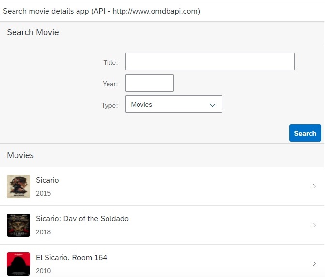

# UI5_OMDB_api
UI5 reading Movies oData from OMDB api

SAP UI5 project that reads data from http://www.omdbapi.com.

There is some usefull examples like Routing, getting values from the DOM, css and so on.

